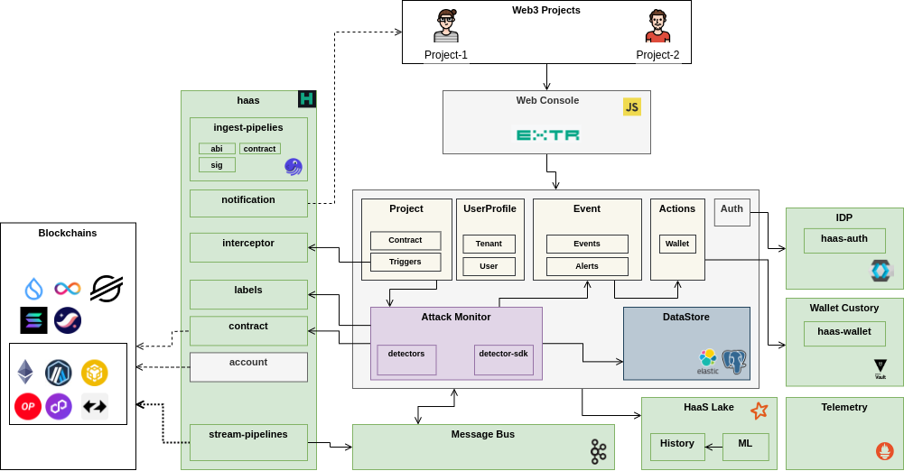
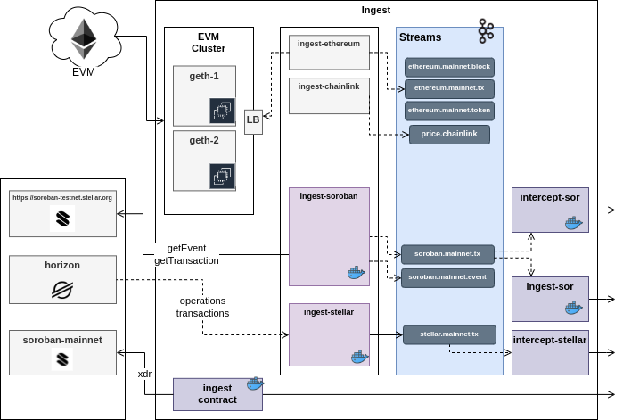

# Architecture Specification
1.5 (Brief)

## System Architecture

## Data Ingestion

Extractor utilizes HaaS Data Platform for ingestion. 
It relies on HaaS layer Ingestion Infrastructure to stream on-chain events for real-time triggers and attack detection datasets (contracts, accounts). 
Off-chain data ingestion pipelines are also provided by HaaS and indexed for fast retrieval (primarily in `Attack Monitor`)

### Blockchain Ingestion

Extractor tries to be agnostic which Blockchain it monitors. 
It is HaaS resposibility to integrate with RPC providers and private nodes to parse data and publish it to Message Bus. Due to differences in Blockchain specifications (transactions, smart-contracts, events, etc.) HaaS does not try to generalize on data schema. Extractor as a consumer is not agnostic and deploys dedicated interceptors and attack monitors for each Blockchain. 

#### Architecture Diagram for Integration with Stellar Blockchain

